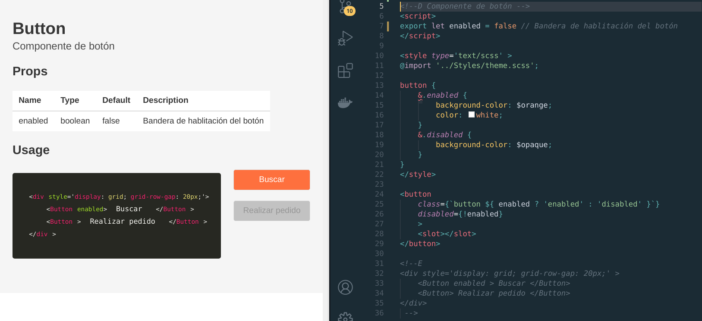

# Svelte blueprint 🏗️

##  Construye documentación de tus componentes en svelte.

> For english go [here](./README.md).

<br/>

Svelte-blueprint revisa los componetes de svelte localizados en un path conocido como **source** y crea nuevos archivos basados en un **template** para colocarlos en el directorio **dst**.

<br/>



<br/>

Instalción
---
```
$ npm i -D svelte-blueprint
```

Ajustes en svelte
---
Los archivos .svelte localizados en el directorio **source** deben agregar algunos comentarios.

- Para agregar una descripción del componente agrega al inicio:
    ```html
    <!--D Description of the component -->
    ```
- Para agregar una descripción a una propiedad del componente, inserta un comentario de una sola línea junto a la misma.
    ```js
    export let name // Name string
    ```

- Para agregar un ejemplo de uso del componente agrega:  
    *Si requieres usar comillas, usa **comillas imples ' '***
    ```html
    <!--E
        <Component  />
    -->
    ```

<br/>


Generación de blueprints
---
Para generar los archivos de coeumtnación, puedes usar un **plugin** para un bundler específico o usar el cli.

### Plugins
-  [Rollup](https://www.npmjs.com/package/rollup-plugin-svelte-blueprint)


### Cli  

Uso:
```bash
$ svelte-blueprint
```
Options:  
|Short|Long|Default|Descripción| Tipo|
|--|--|--|--|--|
||--help||Muestra ayuda| [booleano]
||--version || Muestra número de versión | [booleano]
|-s | --source |src/Components| Directorio fuente de los componentes |[cadena de caracteres]
|-d | --dst | Blueprints | Direcotorio destino de los blueprints | [cadena de caracteres]
|-w | --watch | false | Bandera para vigilar los archivos fuente y regenrar los blueprints |[booleano]
|-t | --template | svelte-blueprint/templates/Blueprint.svelte | Dirección de un template a usar en lugar del default |[cadena de caracteres]  
  
<br/>
<br/>

## Templates
Por defecto, la herramienta utiliza un template contenido en la biblioteca. 

Para adaptarlo a tus necesidades puedes sobre escribir las variables css del template default o bien usar un template propio. 


Estas son las variables de los colores que puedes sobre escribir.

```css
 :global(:root) {
    --svelte-blueprint-background: transparent;
    --svelte-blueprint-color: #3e3e3e;
    --svelte-blueprint-accent: #55c1ff;
    --svelte-blueprint-table-border: #e7e7e7;
    --svelte-blueprint-table-background: #fff;
    --svelte-blueprint-table-hover: #eaeaea;
    --svelte-blueprint-table-header-color: #fff;
}
```

Si necesitas usar tu propio template, estos son los *slots* que debes definir en tu template:
```html
<slot name='description' > 
    Component description
</slot>
<slot name='props'>
    Component properties
</slot>
<slot name='example'>
    Component example
</slot>
```

También tienes disponibles estas props:
```js
title
code
```

Para un mejor entendimiento dale un vistazo al [template por default](./templates/Blueprint.svelte)

## Guias
- [Youtube](https://www.youtube.com/watch?v=Z-znFCs7Cuc&t=14s&ab_channel=evesan)
