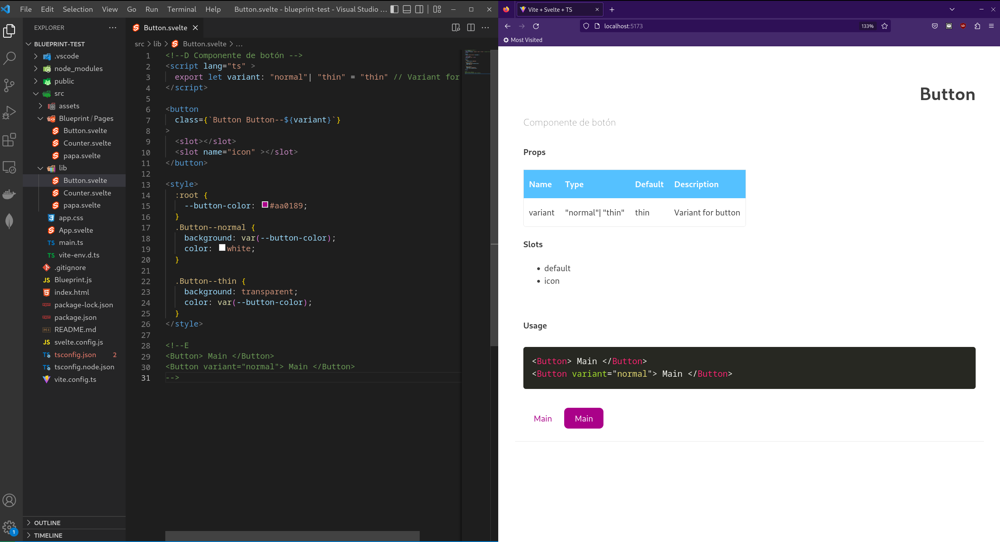

# Svelte blueprint

_Crea archivos de documentación para tus compomentes en svelte usando solo comentarios._



> Notas

- Este paquete puede ser entendido como una biblioteca o un cli, si necesitas integrarlo con un projecto en vite, revisa el plugin complementario [vite-plugin-svelte-blueprint](https://www.npmjs.com/package/vite-plugin-svelte-blueprint)
- Para la versión 2.0.0 todo el código de `js` se migró a `rust-lang`
- Este paquete realizo la migración de ffi-napi a koffi, la razon es que **ffi-napi ya no funciona con Node.js versiones superiores a la 21.0.0**, ffi-napi permitía que Node.js llamara funciones de la librería Rust.

**¿Por qué pasaba esto?**

- Node.js cambió las firmas de las funciones de la API nativa

- ffi-napi v4.0.3 no está actualizado para estos cambios

- El error ocurre durante `npm install`, no al ejecutar el código

## 📊 Beneficios Obtenidos de la Migración

### 🚀 Compatibilidad Futura

- **Antes**: Solo Node.js ≤ v16

- **Ahora**: Node.js v16, v18, v20, v22, y futuras versiones

### 🔧 Código Más Robusto

- **Ahora**: Agregamos un try/catch para detectar problemas

### 📦 Mantenimiento

- **Antes**: ffi-napi sin actualizaciones recientes

- **Ahora**: koffi con actualizaciones regulares

## 📜 Requisitos

Debido a que se requiren algunas compilaciones para la instalación de este paquete de npm, deberás tener algunas herramientas en tu sistema.

```bash
$ apt-get install make gcc g++ -y
$ curl --proto '=https' --tlsv1.2 -sSf https://sh.rustup.rs | sh # installacion de rust
```

## 🛠️ Como usarlo

Para instalar este paquete, usa npm como siempre.

```
$ npm i -D svelte-blueprint
```

Los compnentes de svlelte, deben incluir algunos comentarios para generar documentación más explícita.

- Para definir la descripción de un componente, usa un comentario como el siguiente.
  ```html
  <!--D Description of the component -->
  ```
- Para agregar la descripcíon de un `prop`, usa un comentario al lado de la definición.

  ```js
  export let name; // Name string
  ```

- Para agregr un ejemplo de uso, agrega un comentario como el siguiente:
  ```html
  <!--E
      <Component  />
  -->
  ```

Ahora puedes usar el cli para generar la documentación de un componente indicando el archivo fuente, el directorio destino y un template que es opcional.

- -s, --source <FILE> Sets a source path
- -d, --destination <Directory> Sets a destination path
- -t, --template <FILE> Sets a template for the final component

```bash
$ ./node_modules/svelte-blueprint/blueprint/target/release/blueprint document --source ./hello.svelte --destination ./docs
```

Recuerda que hay un plug in complemtario [vite-plugin-svelte-blueprint](https://www.npmjs.com/package/vite-plugin-svelte-blueprint) para vite.

## 🍱 Templates

Por defecto, los archivos de coemuentación generados usan un template definido en este biblioteca.

Aún así, puedes customizar los colores de ese template.

Estas son las variables que podrías sobre esribir para usar tu propia paleta de colores.

```css
:global(:root) {
  --svelte-blueprint-background: transparent;
  --svelte-blueprint-color: #3e3e3e;
  --svelte-blueprint-accent: #55c1ff;
  --svelte-blueprint-table-border: #e7e7e7;
  --svelte-blueprint-table-background: #fff;
  --svelte-blueprint-table-hover: #eaeaea;
  --svelte-blueprint-table-header-color: #fff;
}
```

Si necesitas usa un tempate propio, estos son los `slots` que debes definir:

```html
<slot name="description"> Component description </slot>
<slot name="props"> Component properties </slot>
<slot name="slots"> Component slots </slot>
<slot name="example"> Component example </slot>
```

Debes tomar en cuenta estas props también:

```js
title;
code;
```

Para un mayor entendimiento de los templates puedes revisar el [default template](./templates/Blueprint.svelte)

🌄 Guías

- [Youtube](https://www.youtube.com/watch?v=Z-znFCs7Cuc&t=14s&ab_channel=evesan) para svelte-blueprint < 2.0.0
