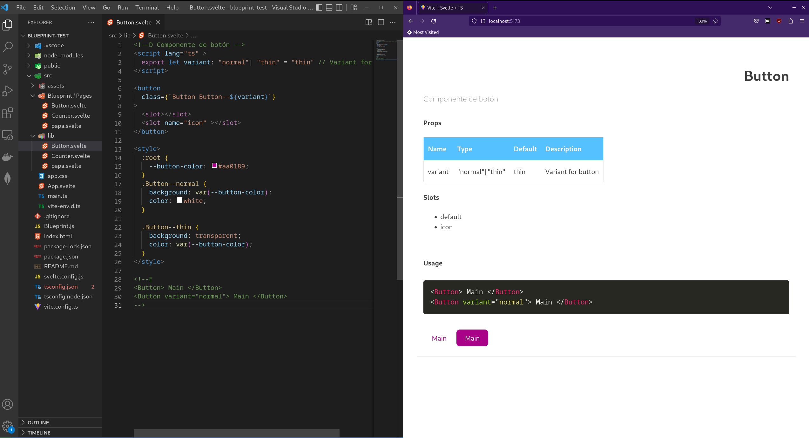

# Svelte blueprint 🏗️
##  Build svelte components documentation.
*Svelte-blueprint create documentation files for components based in comments in the source code.*

<br/>

> ⚠️ For version 2.0.0 all `js` code has been migrated to `rust-lang`. 

> 🗨️ For spanish go [here](./README-es.md).


<br/>

## Install

```
$ npm i -D svelte-blueprint
```
Example of output:




## Creating a component ...

Svelte component files should include some comments in order to generate a better documenation file.

- A description for the comment can be included as:
    ```html
    <!--D Description of the component -->
    ```
- To add a description of a prop just add a single line comment next to it's definition.
    ```js
    export let name // Name string
    ```

- To set usage example add:
    ```html
    <!--E
        <Component  />
    -->
    ```

<br/>

The tool can be used in a svelte project via `plugins` or `cli`.

### 🔌 Plugins
-  [Rollup](https://www.npmjs.com/package/rollup-plugin-svelte-blueprint) for svelte-blueprint < 2.0.0
- [Vite](https://www.npmjs.com/package/vite-plugin-svelte-blueprint) for svelte-blueprint >= 2.0.0


### 🖥️ Cli  

After the package is installed it can run via terminal client.

**Usage**

```bash
$ ./node_modules/svelte-blueprint/blueprint/target/release/blueprint -h
Usage: blueprint [OPTIONS] [COMMAND]

Commands:
  document  Create svelte documentation files
  help      Print this message or the help of the given subcommand(s)

Options:
  -v, --verbose...  Turn debugging information on
  -h, --help        Print help
  -V, --version     Print version
```

**Command document**

```bash
$ ./node_modules/svelte-blueprint/blueprint/target/release/blueprint document -h
Create svelte documentation files

Usage: blueprint document [OPTIONS] --source <FILE> --destination <Directory>

Options:
  -s, --source <FILE>            Sets a source path
  -d, --destination <Directory>  Sets a destination path
  -t, --template <FILE>          Sets a template for the final component
  -h, --help                     Print help

```
  
<br/>
<br/>

## Templates
By default, the genrated Blueprint file uses a Blueprint Component contained in this library.

You can customize the colors of that template or use your own template.

These are the variables you may want to override to match your own style.

```css
 :global(:root) {
    --svelte-blueprint-background: transparent;
    --svelte-blueprint-color: #3e3e3e;
    --svelte-blueprint-accent: #55c1ff;
    --svelte-blueprint-table-border: #e7e7e7;
    --svelte-blueprint-table-background: #fff;
    --svelte-blueprint-table-hover: #eaeaea;
    --svelte-blueprint-table-header-color: #fff;
}
```


If you need to use your own template this are the svelete *slots* you should define:
```html
<slot name='description' > 
    Component description
</slot>
<slot name='props'>
    Component properties
</slot>
<slot name='slots'>
    Component slots
</slot>
<slot name='example'>
    Component example
</slot>
```

Also you may want to use these props:
```js
title
code
```

For a better understanding, checkout the [default template](./templates/Blueprint.svelte)

## Guides
- [Youtube](https://www.youtube.com/watch?v=Z-znFCs7Cuc&t=14s&ab_channel=evesan) for svelte-blueprint < 2.0.0
